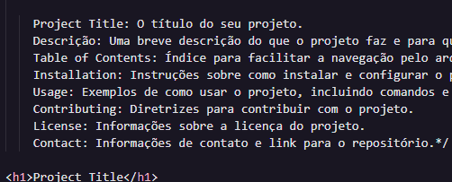

<!DOCTYPE html>
<html lang="en">
<head>
<meta charset="UTF-8">
<meta name="viewport" content="width=device-width, initial-scale=1.0">
</head>
<body>

/*Descrição das seções:

    Project Title: O título do seu projeto.
    Descrição: Uma breve descrição do que o projeto faz e para quem ele é.
    Table of Contents: Índice para facilitar a navegação pelo arquivo README.
    Installation: Instruções sobre como instalar e configurar o projeto.
    Usage: Exemplos de como usar o projeto, incluindo comandos e capturas de tela.
    Contributing: Diretrizes para contribuir com o projeto.
    License: Informações sobre a licença do projeto.
    Contact: Informações de contato e link para o repositório.*/

<h1>Project Title</h1>

A brief description of what this project does and who it's for

<h2>Table of Contents</h2>
<ul>
  <li><a href="#installation">Installation</a></li>
  <li><a href="#usage">Usage</a></li>
  <li><a href="#contributing">Contributing</a></li>
  <li><a href="#license">License</a></li>
  <li><a href="#contact">Contact</a></li>
</ul>

[]

<h2 id="installation">Installation</h2>

Instructions on how to install and setup the project. You can include the code commands here:

<pre><code>
git clone https://github.com/yourusername/your-repo-name.git
cd your-repo-name
npm install
</code></pre>

<h2 id="usage">Usage</h2>

Examples of how to use the project. Include code snippets and screenshots if possible.

<pre><code>
npm start
</code></pre>

Once started, navigate to <code>http://localhost:3000</code> to view the application.

<h2 id="contributing">Contributing</h2>

Guidelines for contributing to the project. Mention the code of conduct, if any, and how to submit pull requests.

<h2 id="license">License</h2>

This project is licensed under the MIT License - see the <a href="LICENSE">LICENSE</a> file for details.

<h2 id="contact">Contact</h2>

Your Name - <a href="mailto:your-email@example.com">your-email@example.com</a>

Project Link: <a href="https://github.com/yourusername/your-repo-name">https://github.com/yourusername/your-repo-name</a>

</body>
</html>

